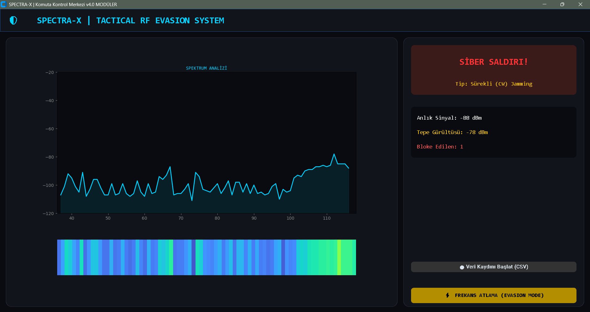
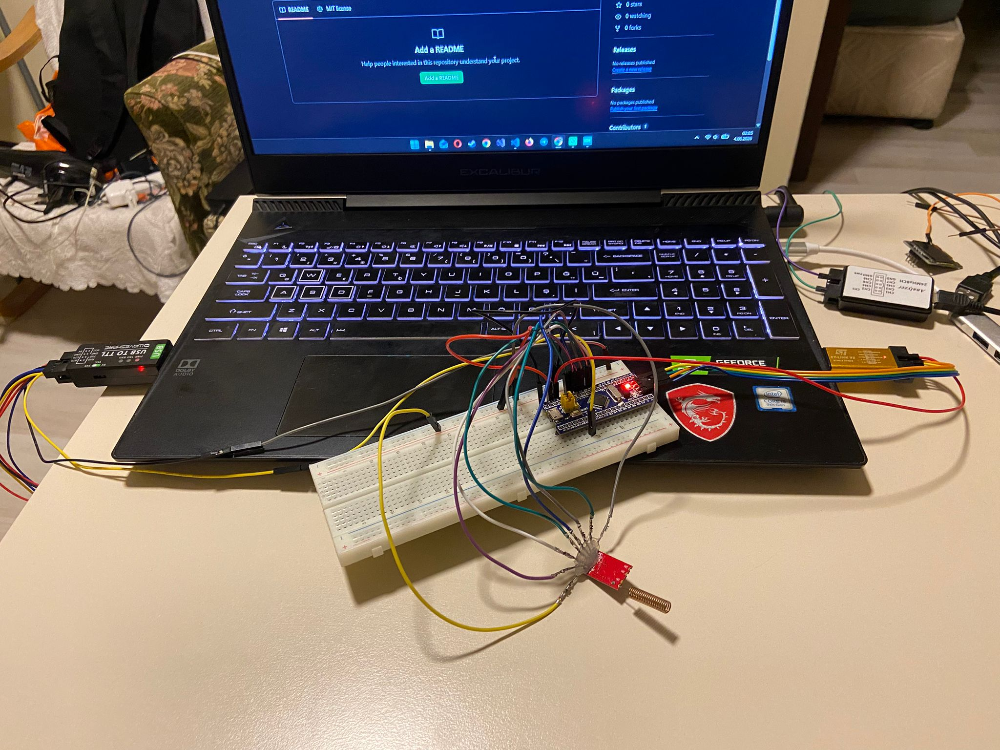
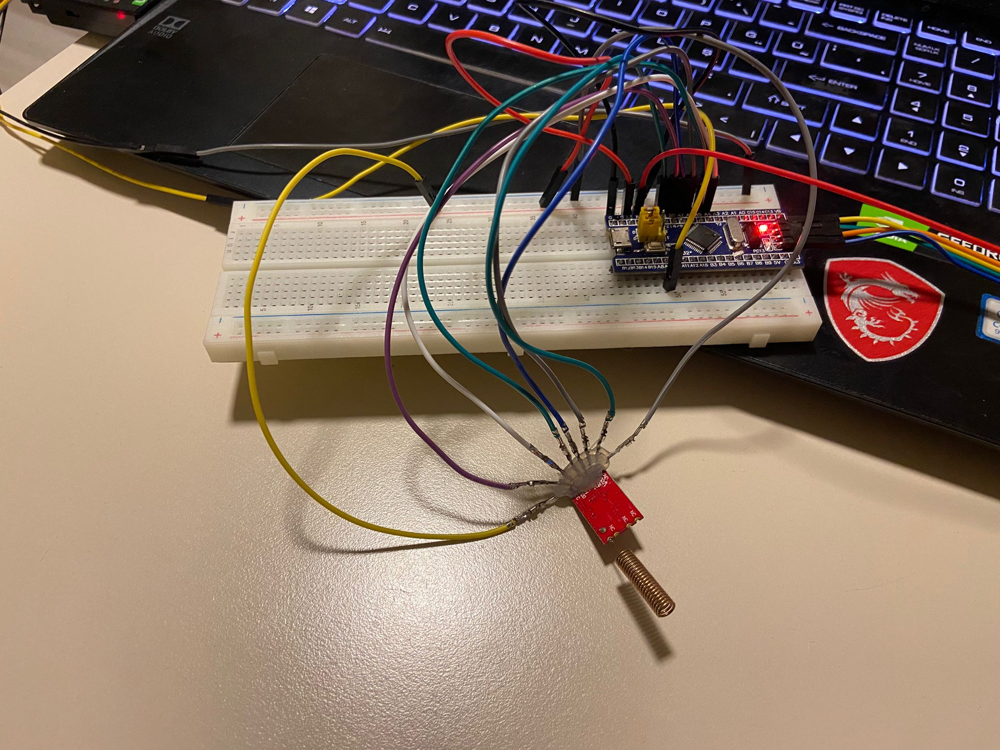
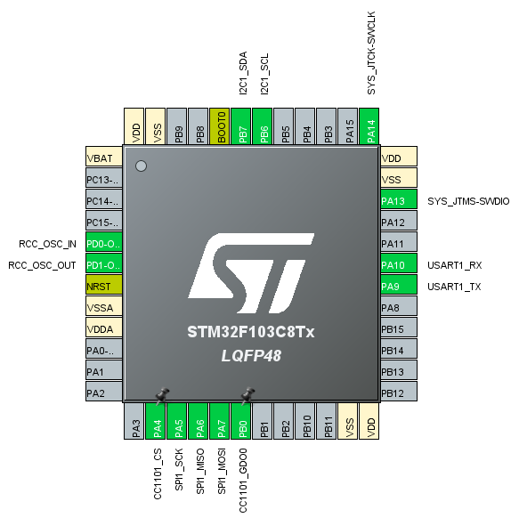

# 🛡️ SPECTRA-X: Tactical RF Evasion System


SPECTRA-X is an intelligent cyber-defense and telemetry platform designed to protect Wireless Sensor Networks (WSNs) and IoT devices against **Broadband Jamming** and **Flood (Replay Packet)** attacks. The system combines hardware-level threat detection, real-time spectrum monitoring, and Frequency Hopping Spread Spectrum (FHSS) capabilities to maintain communication reliability under hostile RF conditions.

By continuously analyzing RF activity, SPECTRA-X detects abnormal behavior, classifies threats, and automatically switches to a safer communication channel when necessary.

---

# Command & Control Center

Real-time spectrum analysis, waterfall heatmaps, and AI-assisted threat classification dashboard.



---

# Key Features

### Multi-Layer Threat Detection

* Hardware-based hysteresis filtering on STM32
* Statistical variance analysis on the Python backend
* Noise and interference discrimination
* Real-time anomaly detection

### Active Countermeasures (Evasion Mode)

* Manual frequency switching
* Autonomous FHSS support
* Secure channel migration
* Communication continuity during attacks

### Real-Time RF Monitoring

* Live RSSI tracking
* Spectrum visualization
* Waterfall heatmap display
* Threat status indicators

### Intelligent Threat Classification

* Continuous Wave (CW) Jamming detection
* Flood / Replay attack detection
* Statistical variance analysis
* Rule-based threat assessment

### Data Logging

* CSV-based data recording
* Millisecond-resolution telemetry
* Machine learning dataset generation
* Historical attack analysis

---

# System Architecture

```text
                 RF Environment
                        │
                        ▼
             ┌──────────────────┐
             │      CC1101      │
             │ RF Transceiver   │
             └────────┬─────────┘
                      │ SPI
                      ▼
             ┌──────────────────┐
             │ STM32F103C8T6    │
             │ Detection Layer  │
             └────────┬─────────┘
                      │ UART
                      ▼
       ┌─────────────────────────────────┐
       │ Python Command & Control Center │
       │ Threat Classification Engine    │
       │ Data Logger                     │
       │ Visualization System            │
       └────────────────┬────────────────┘
                        │
                        ▼
              Frequency Hopping
                 Countermeasure
```

---

# Hardware Architecture

## Components Used

| Component          | Description          |
| ------------------ | -------------------- |
| STM32F103C8T6      | Main microcontroller |
| CC1101             | RF transceiver       |
| USB-to-TTL Adapter | PC communication     |
| Breadboard         | Rapid prototyping    |
| 3.3V Regulator     | Power management     |

---

# Wiring Diagram

| CC1101 Pin | STM32 Pin | Function        |
| ---------- | --------- | --------------- |
| GND        | GND       | Ground          |
| VCC        | 3.3V      | Power           |
| CSN        | PA4       | SPI Chip Select |
| SCK        | PA5       | SPI Clock       |
| MOSI       | PA7       | SPI Master Out  |
| MISO       | PA6       | SPI Master In   |

### UART Communication

| STM32    | USB-TTL |
| -------- | ------- |
| PA9 (TX) | RX      |
| GND      | GND     |

**Baud Rate:** 115200

---

# Breadboard Prototype

<p align="center">
  
  
</p>

---

# STM32CubeMX Configuration

The following settings were used:

* SPI1 Enabled
* Full Duplex Master Mode
* UART1 Enabled
* 115200 Baud Rate
* External HSE Crystal
* SWD Debug Interface



---

# Software Installation

## Clone the Repository

```bash
git clone https://github.com/CinarSamet/spectra-x.git
cd spectra-x
```

## Install Dependencies

```bash
pip install customtkinter matplotlib numpy pyserial
```

## Configure Serial Port

Open `config.py` and update your serial port:

Windows:

```python
SERIAL_PORT = "COM3"
```

Linux:

```python
SERIAL_PORT = "/dev/ttyUSB0"
```

macOS:

```python
SERIAL_PORT = "/dev/cu.usbserial"
```

## Run the Dashboard

```bash
python main.py
```

---

# Detection Algorithm

Unlike traditional systems that rely solely on a fixed threshold, SPECTRA-X evaluates multiple RF characteristics:

* Average RSSI
* RSSI rise rate
* Moving-window variance
* Standard deviation (σ)

---

## Continuous Wave (CW) Jamming Detection

```text
RSSI > Threshold
σ < 3.0
```

A high-power signal with very low variance is classified as:

```text
Continuous Wave Jamming
```

---

## Flood / Replay Attack Detection

```text
RSSI > Threshold
σ > 3.0
```

A high-power signal with irregular fluctuations is classified as:

```text
Flood / Replay Attack
```

---

# Dataset Generation

The platform can generate labeled RF telemetry datasets in CSV format:

```csv
timestamp,rssi,variance,label
1250,47,1.2,NORMAL
1260,91,0.8,JAMMING
1270,88,8.4,FLOOD
```

These datasets can be used to train:

* Random Forest
* XGBoost
* Support Vector Machines (SVM)
* Neural Networks

---

# Roadmap

## Version 1.0

* [x] STM32 RF Telemetry
* [x] Python Dashboard
* [x] Waterfall Visualization
* [x] CSV Data Logging
* [x] Hysteresis-Based Detection

## Version 2.0

* [ ] Random Forest Integration
* [ ] XGBoost Classifier
* [ ] Autonomous Frequency Hopping
* [ ] Threat History Analysis
* [ ] ML Training Interface

## Version 3.0

* [ ] Multi-CC1101 Support
* [ ] Mesh Network Protection
* [ ] SDR Integration
* [ ] LoRa Support
* [ ] Edge AI Module

---

# Applications

* Wireless Sensor Networks (WSN)
* Industrial IoT Systems
* Smart Agriculture Infrastructure
* Critical Telemetry Links
* Drone Communication Networks
* RF Security Research
* Embedded Security Platforms
* Defense and Aerospace Communication Systems

---

# License

This project is licensed under the MIT License.

For more information, see:

```text
LICENSE
```

---

# Developer

**Samet Çınar**

Computer Engineer

Embedded Systems • RF Security • IoT • Artificial Intelligence

---

> **Detect. Analyze. Evade.**
>
> **SPECTRA-X — Tactical RF Evasion System**
